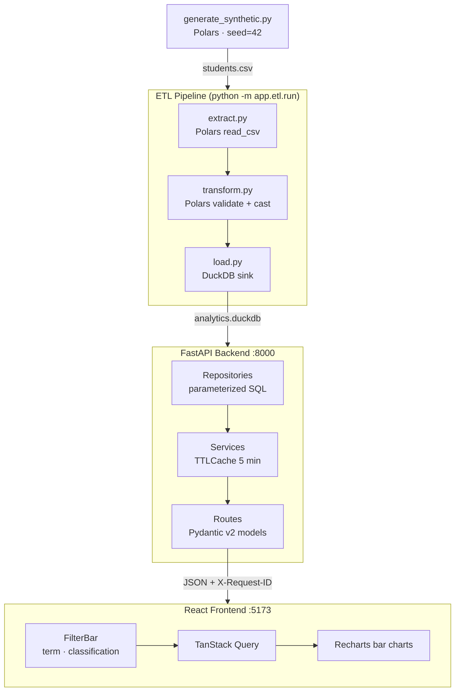

# Student Enrollment & Retention Analytics Dashboard

[](https://github.com/Siddiqueeahmed/student-analytics/actions/workflows/backend.yml)
[](https://github.com/Siddiqueeahmed/student-analytics/actions/workflows/frontend.yml)
[](LICENSE)

A production-grade full-stack analytics application that surfaces enrollment trends, student retention rates, and GPA distributions across colleges and academic programs. Built as a portfolio project to demonstrate end-to-end data engineering skills: ETL pipelines, analytical query patterns, typed REST API design, and interactive data visualization.

## Architecture



## Live Demo

> Coming after Phase 3 deployment.

## Quickstart — Docker (recommended)

```bash
git clone https://github.com/Siddiqueeahmed/student-analytics.git
cd student-analytics
docker compose up --build
```

Open [http://localhost:5173](http://localhost:5173).

## Quickstart — local development

**Prerequisites:** Python 3.11+, Node 20+

```bash
# 1. Generate data
pip install polars
python data/generate_synthetic.py

# 2. Backend
cd backend
pip install -e ".[dev]"
python -m app.etl.run           # populates analytics.duckdb
uvicorn app.main:app --reload   # → http://localhost:8000/docs

# 3. Frontend (new terminal)
cd frontend
npm install
npm run dev                     # → http://localhost:5173
```

## API endpoints (Phase 2)

All endpoints accept optional query parameters:

| Param | Example | Notes |
|-------|---------|-------|
| `term` | `Fall2024` | Pattern `^(Fall\|Spring)\d{4}$` |
| `classification` | `Freshman` | Repeatable for multi-select |

| Method | Path | Description |
|--------|------|-------------|
| GET | `/api/health` | Health check |
| GET | `/api/enrollment/by-college` | Enrolled students per college |
| GET | `/api/retention/by-classification` | Retention rate per classification |
| GET | `/api/gpa/distribution` | Student count per 0.5-point GPA band |

Interactive docs: [http://localhost:8000/docs](http://localhost:8000/docs)

## Development

```bash
# Backend quality checks
cd backend
ruff check .
ruff format --check .
mypy app
pytest          # enforces 80% coverage

# Frontend quality checks
cd frontend
npm run lint
npx tsc --noEmit
npm run test
```

## Project structure

```
student-analytics/
├── backend/
│   ├── app/
│   │   ├── api/          # Thin route handlers (Pydantic response_model)
│   │   ├── core/         # Config, DuckDB singleton, structlog setup
│   │   ├── etl/          # extract → transform → load pipeline
│   │   ├── middleware/   # X-Request-ID propagation
│   │   ├── models/       # Pydantic v2 response schemas
│   │   ├── repositories/ # Parameterized SQL queries
│   │   └── services/     # Business logic + TTLCache
│   └── tests/
│       ├── unit/         # Service tests (repo mocked)
│       └── integration/  # Route tests (in-memory DuckDB)
├── frontend/
│   └── src/
│       ├── api/          # TanStack Query hooks + TypeScript types
│       ├── components/   # Charts, FilterBar, Skeleton, ErrorBoundary
│       └── pages/        # Dashboard
├── data/
│   └── generate_synthetic.py
├── .github/workflows/    # backend.yml · frontend.yml
└── docker-compose.yml
```

## Phase roadmap

| Phase | Focus | Status |
|-------|-------|--------|
| 1 — Beginner | MVP: in-memory CSV, 3 charts, Docker Compose | ✅ done |
| 2 — Intermediate | DuckDB ETL, repository pattern, TanStack Query, CI | ✅ done |
| 3 — Expert | Star schema, OpenTelemetry, JWT auth, Fly.io deploy | 🔜 |

## Tech decisions

- **Polars over pandas** — zero-copy columnar ops, 2–10× faster for aggregation at this scale
- **DuckDB over Postgres** — embedded OLAP engine, no infra to manage for a portfolio project
- **TanStack Query over Redux** — server-state belongs in a cache, not a global store
- **Repository pattern** — SQL stays in one layer; routes and services never touch raw queries

## License

MIT © 2026 Siddique Ahmed
