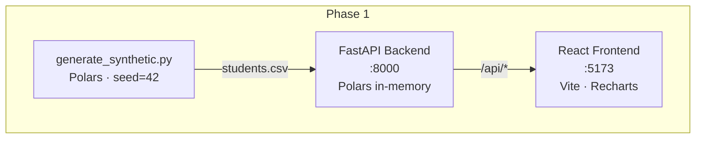

# Student Enrollment & Retention Analytics Dashboard

A production-grade full-stack analytics application that surfaces enrollment trends, student retention rates, and GPA distributions across colleges and academic programs. Built as a portfolio project to demonstrate end-to-end data engineering skills: ETL pipelines, analytical query patterns, typed REST API design, and interactive data visualization.

## Architecture



## Live Demo

> Coming after Phase 3 deployment.

## Quickstart — Docker (recommended)

```bash
git clone https://github.com/SiddiqueAhmad/student-analytics.git
cd student-analytics
docker compose up --build
```

Open [http://localhost:5173](http://localhost:5173).

> The backend Docker image generates the synthetic dataset (`data/students.csv`) at build time, so no separate data-generation step is needed.

## Quickstart — local development

**Prerequisites:** Python 3.11+, Node 20+

```bash
# 1. Generate synthetic data
cd student-analytics
pip install polars
python data/generate_synthetic.py

# 2. Start the backend
cd backend
pip install -e .
uvicorn app.main:app --reload
# → http://localhost:8000/docs

# 3. Start the frontend (new terminal)
cd frontend
npm install
npm run dev
# → http://localhost:5173
```

## API endpoints (Phase 1)

| Method | Path | Description |
|--------|------|-------------|
| GET | `/api/health` | Health check |
| GET | `/api/enrollment/by-college` | Enrolled students per college |
| GET | `/api/retention/by-classification` | Retention rate per classification |
| GET | `/api/gpa/distribution` | Student count per 0.5-point GPA band |

Interactive docs: [http://localhost:8000/docs](http://localhost:8000/docs)

## Project structure

```
student-analytics/
├── backend/          # FastAPI · Polars · Uvicorn
│   ├── app/
│   │   ├── api/      # Thin route handlers
│   │   ├── state.py  # In-memory DataFrame (Phase 1)
│   │   └── main.py
│   └── pyproject.toml
├── frontend/         # Vite · React 18 · TypeScript strict · Recharts
│   └── src/
│       ├── components/   # EnrollmentChart, RetentionChart, GpaChart
│       └── pages/        # Dashboard
├── data/
│   └── generate_synthetic.py   # 5,000 rows, seed=42
├── docker-compose.yml
└── .env.example
```

## Phase roadmap

| Phase | Focus | Status |
|-------|-------|--------|
| 1 — Beginner | MVP: in-memory CSV, 3 charts, Docker Compose | ✅ done |
| 2 — Intermediate | DuckDB ETL, repository pattern, TanStack Query, CI | 🔜 |
| 3 — Expert | Star schema, OpenTelemetry, JWT auth, Fly.io deploy | 🔜 |

## Tech decisions

- **Polars over pandas** — zero-copy columnar ops, 2–10× faster for aggregation at this scale; see `docs/adr/0002-polars-over-pandas.md` (Phase 3).
- **DuckDB over Postgres** (Phase 2+) — embedded OLAP engine, no infra to manage for a portfolio project; see `docs/adr/0001-duckdb-over-postgres.md`.
- **TanStack Query over Redux** (Phase 2+) — server-state belongs in a cache, not a global store; see `docs/adr/0004-no-redux.md`.

## License

MIT © 2026 Siddique Ahmed
