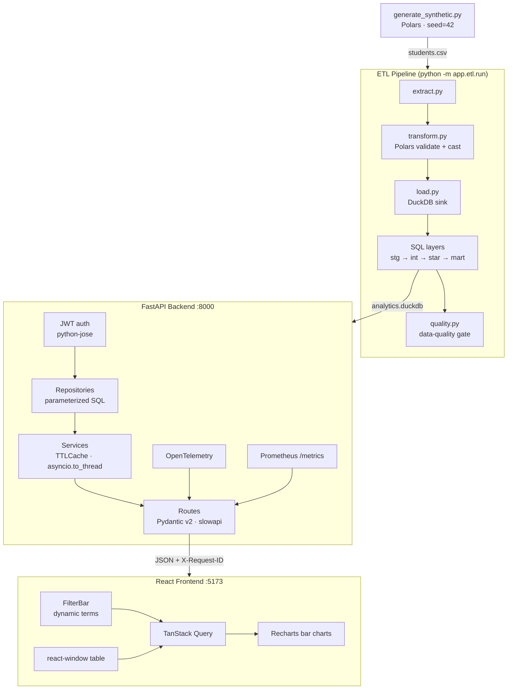

# Student Enrollment & Retention Analytics Dashboard

[](https://github.com/Siddiqueeahmed/student-analytics/actions/workflows/backend.yml)
[](https://github.com/Siddiqueeahmed/student-analytics/actions/workflows/frontend.yml)
[](LICENSE)

A production-grade full-stack analytics application that surfaces enrollment trends, student retention rates, and GPA distributions across colleges and academic programs. Built as a portfolio project to demonstrate end-to-end data engineering skills: ETL pipelines, star schema dimensional modeling, typed REST API design, JWT auth, observability, and interactive data visualization.

## Architecture



## Quickstart — Docker (recommended)

```bash
git clone https://github.com/Siddiqueeahmed/student-analytics.git
cd student-analytics

# Set a real secret key (required for JWT auth)
export SECRET_KEY=$(python -c "import secrets; print(secrets.token_hex(32))")

docker compose up --build
```

Open [http://localhost:5173](http://localhost:5173).  
API docs: [http://localhost:8000/docs](http://localhost:8000/docs)

## Quickstart — local development

**Prerequisites:** Python 3.11+, Node 20+

```bash
# 1. Generate data
pip install polars
python data/generate_synthetic.py

# 2. Backend
cd backend
pip install -e ".[dev]"
cp .env.example .env          # then set SECRET_KEY in .env
python -m app.etl.run         # populates analytics.duckdb
uvicorn app.main:app --reload # → http://localhost:8000/docs

# 3. Frontend (new terminal)
cd frontend
npm install
npm run dev                   # → http://localhost:5173
```

## API Reference

### Public endpoints

| Method | Path | Description |
|--------|------|-------------|
| GET | `/api/health` | Health check |
| POST | `/api/auth/token` | Issue JWT (OAuth2 password flow) |
| GET | `/api/enrollment/by-college` | Enrolled students per college |
| GET | `/api/retention/by-classification` | Retention rate per classification |
| GET | `/api/gpa/distribution` | Student count per 0.5-point GPA band |
| GET | `/api/students` | Paginated student records (limit 1–1000) |
| GET | `/api/meta/terms` | Available filter terms |
| GET | `/metrics` | Prometheus metrics |

### Authenticated endpoints (Bearer JWT required)

| Method | Path | Role | Description |
|--------|------|------|-------------|
| POST | `/api/admin/etl/refresh` | admin | Re-run ETL in-place, invalidate caches |

### Seed credentials (dev only)

| Email | Password | Role |
|-------|----------|------|
| viewer@example.com | viewer123 | viewer |
| analyst@example.com | analyst123 | analyst |
| admin@example.com | admin123 | admin |

### Filter query parameters

| Param | Example | Notes |
|-------|---------|-------|
| `term` | `Fall2024` | Pattern `^(Fall\|Spring)\d{4}$` |
| `classification` | `Freshman` | Repeatable for multi-select |

## Development

```bash
# Backend
cd backend
ruff check . && ruff format --check .
mypy app
pytest              # enforces 80% coverage

# Frontend
cd frontend
npm run lint
npx tsc --noEmit
npm run test
npm run storybook   # component explorer on :6006
```

## Project structure

```
student-analytics/
├── backend/
│   ├── app/
│   │   ├── api/          # Thin async route handlers
│   │   ├── auth/         # JWT encode/decode, dependencies, models
│   │   ├── core/         # Config, DuckDB singleton, structlog, telemetry
│   │   ├── etl/          # extract → transform → load → quality
│   │   ├── middleware/   # X-Request-ID propagation
│   │   ├── models/       # Pydantic v2 response schemas
│   │   ├── repositories/ # Parameterized SQL against mart tables
│   │   ├── services/     # Thundering-herd-safe TTLCache + asyncio.to_thread
│   │   └── sql/models/   # stg → int → star → mart SQL layers
│   └── tests/
│       ├── unit/         # Async service tests (repo mocked)
│       └── integration/  # Route tests (in-memory DuckDB with mart tables)
├── frontend/
│   └── src/
│       ├── api/          # TanStack Query hooks + TypeScript types
│       ├── components/   # Charts, FilterBar (dynamic terms), StudentTable
│       └── pages/        # Dashboard, Students
├── docs/
│   ├── adr/              # 5 Architecture Decision Records
│   ├── erd.md            # Star schema Mermaid diagrams
│   ├── security.md       # STRIDE threat model
│   └── performance.md    # EXPLAIN ANALYZE before/after
├── data/
│   └── generate_synthetic.py
├── .github/workflows/    # backend.yml · frontend.yml · deploy.yml
├── fly.toml              # Fly.io backend deployment
├── vercel.json           # Vercel frontend deployment
└── docker-compose.yml
```

## Phase roadmap

| Phase | Focus | Status |
|-------|-------|--------|
| 1 — Beginner | MVP: in-memory CSV, 3 charts, Docker Compose | ✅ done |
| 2 — Intermediate | DuckDB ETL, repository pattern, TanStack Query, CI | ✅ done |
| 3 — Expert | Star schema, JWT auth, OTel, Fly.io + Vercel deploy | ✅ done |

## Tech decisions

- **Polars over pandas** — zero-copy columnar ops, Arrow-native DuckDB handoff
- **DuckDB over Postgres** — embedded OLAP engine, no infra overhead for a portfolio project
- **SQL layered models** — stg → int → star → mart mirrors dbt lineage without dbt dependency
- **TanStack Query over Redux** — server-state belongs in a cache, not a global store
- **Repository pattern** — SQL stays in one layer; routes and services never touch raw queries
- **Thundering-herd-safe cache** — Future planted on first miss; concurrent requests await the same Future

## License

MIT © 2026 Siddique Ahmed
