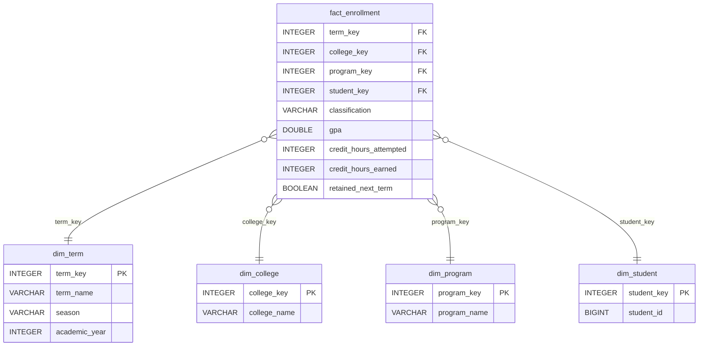
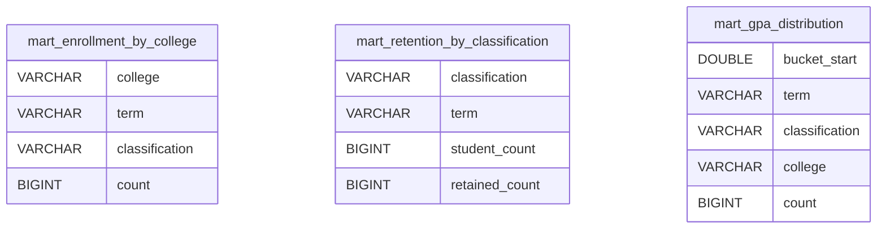
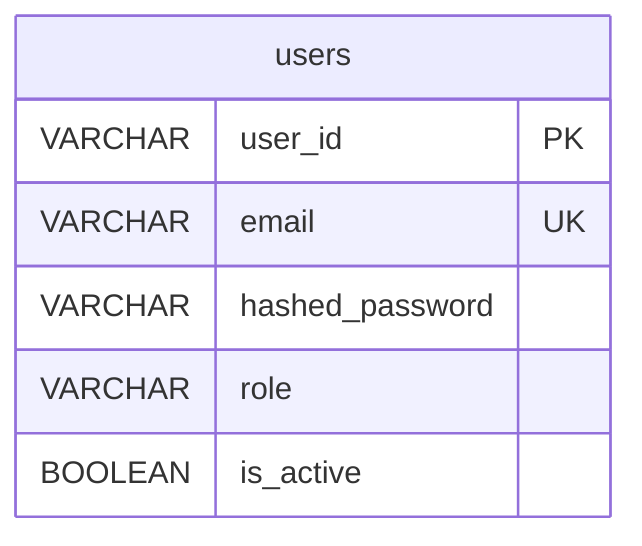

# Entity-Relationship Diagram

The star schema lives in `data/analytics.duckdb`. Raw data flows from CSV → staging → intermediate → star schema → mart tables.

## Star Schema



## Mart Tables (pre-aggregated KPIs)



## ETL Data Flow

```
students.csv
    └─► stg_students          (cast + filter raw rows)
            └─► int_student_term  (derive season, academic_year)
                    └─► dim_*  fact_enrollment  (star schema)
                                    └─► mart_enrollment_by_college
                                    └─► mart_retention_by_classification
                                    └─► mart_gpa_distribution
```

## Auth Table


